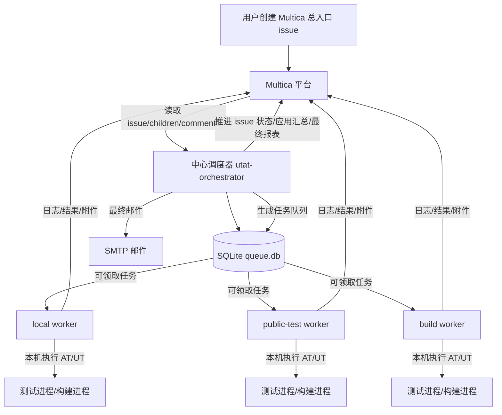
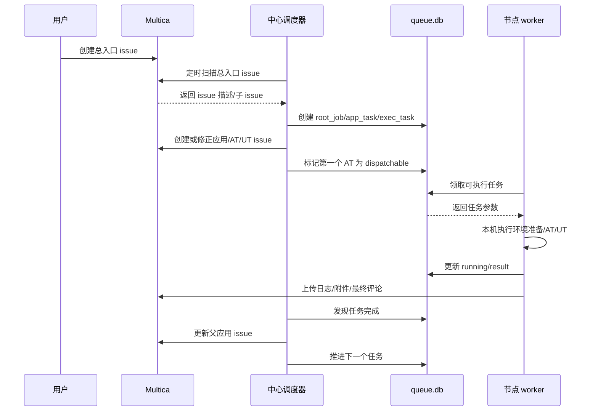
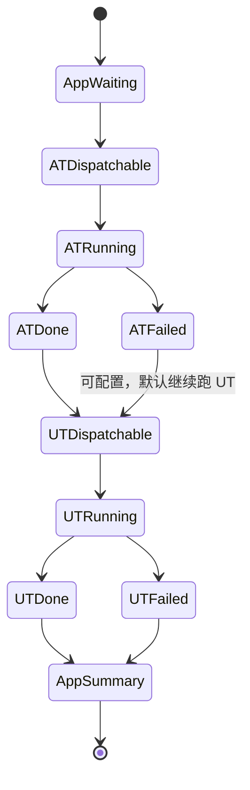
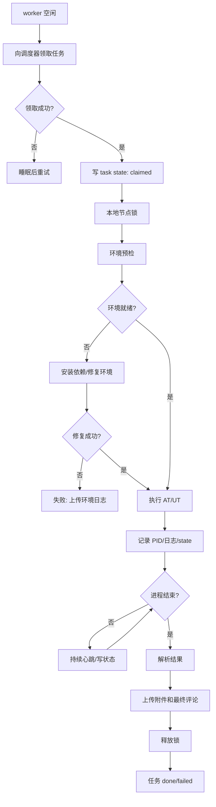

# AT/UT 本地执行调度系统设计方案

> 目标：把 AT/UT 任务执行、长任务管理、任务推进、报表生成从 Multica Agent 的不稳定会话中剥离出来，改为由本地常驻程序稳定执行。Multica 只作为任务入口、状态展示、评论和附件存储平台。

---

## 1. 背景和当前问题

当前 AT/UT 小队主要依赖 Multica Agent 和提示词完成：

1. 创建总入口 issue；
2. 队长创建应用 issue；
3. 队长创建 AT/UT 子 issue；
4. AT/UT 智能体执行测试；
5. 队长等待子 issue 完成后推进下一个应用；
6. 最后生成报表并发邮件。

这个模式在短任务下可用，但在长时间 UT、AT 桌面测试、机器异常、Agent 会话结束等场景下容易中断。

### 1.1 已经遇到的问题

#### 1.1.1 后台任务与 Agent 生命周期脱节

典型案例：`deepin-mail` UT issue：

```text
https://agent-dev.uniontech.com/v25/issues/8780ad1f-6e56-4c06-811c-e513031a1414
```

实际情况：

- UT 进程已经在本地机器执行完成；
- 日志显示全流程完成；
- 但 Multica issue 仍停留在 `in_progress`；
- 队长没有继续推进父应用 issue 和总入口 issue。

根因：

```text
UT 智能体启动后台测试
→ Agent run 很快 completed
→ 智能体评论“我会继续轮询”
→ 实际没有任何持久化轮询进程
→ 测试完成后没人收集结果
→ issue 永久卡住
```

#### 1.1.2 固定超时不适合大型 UT

邮箱 UT 实际运行时间约 4 小时：

```text
编译：约 20 分钟
测试：约 3 小时 41 分钟
总耗时：约 4 小时
```

如果使用固定 2 小时、4 小时、8 小时超时，都可能误杀合法长任务。

结论：

```text
不能用固定总时长判断任务是否失败。
```

#### 1.1.3 Agent 调度推进不稳定

已经出现过多次：

- 子 issue 已完成但父 issue 不推进；
- 队长收到进度评论后误认为还在执行；
- 队长没有等待 AT/UT 全部完成就汇总；
- 只跑完 AT 就生成报表；
- mention 不规范导致没有触发；
- Agent run completed 但实际任务没有最终结果。

本质原因：

```text
任务状态机放在大模型提示词里，大模型每次只看到局部上下文，无法可靠承担持久调度器职责。
```

#### 1.1.4 多机器和公共节点权限限制

现有执行机器包括：

- 本地 local 节点，例如 70 机器；
- 公共测试节点，例如 public-test01；
- build 节点；
- 其他没有 SSH 权限的公共节点。

问题：

```text
中心程序不能假设可以 SSH 到所有公共节点执行命令。
```

所以不能设计成：

```text
中心调度器 SSH 到所有机器执行 AT/UT
```

#### 1.1.5 AT/UT 并发导致环境和资源问题

当前要求：

- 同一个应用的 AT 和 UT 不能同时跑；
- 整体先按单线程跑通；
- 一个应用跑完 AT 再跑 UT；
- 当前应用 AT/UT 都结束后才跑下一个应用；
- 多个入口 issue 同时启动时不能把机器打爆。

#### 1.1.6 编译/打包验证边界不清

已明确规则：

```text
验证执行员不是修复实现员。
编译/打包失败时，只能安装依赖、调整环境、清理 build 后重试。
禁止修改业务源码、测试源码、CMake/debian 构建文件或脚本来让编译通过。
```

本地 worker 也必须遵守这个原则。

---

## 2. 总体目标

### 2.1 核心目标

建设一个本地常驻的 AT/UT 执行调度系统：

```text
Multica 负责展示和存储
本地调度器负责状态机和任务推进
节点 worker 负责实际执行 AT/UT
```

### 2.2 非目标

第一阶段不追求：

- 多应用并发；
- 多入口 issue 并发；
- 智能负载均衡最大化；
- 大模型自动判断所有失败根因；
- 替代所有 Multica 功能。

第一阶段目标是：

```text
稳定跑通一个总入口 issue 的完整 AT/UT 流程。
```

---

## 3. 总体架构

### 3.1 架构图



### 3.2 组件职责

| 组件 | 职责 | 是否依赖 Agent |
|---|---|---|
| Multica | issue 展示、评论、附件、状态 | 否 |
| 中心调度器 | 任务拆解、状态机、并发控制、推进、报表 | 否 |
| 节点 worker | 本机执行 AT/UT、记录日志、上传结果 | 否 |
| bootstrap skill | 安装/配置 worker | 是，但只用于一次性安装 |
| AT/UT 智能体 | 可选日志分析，不参与主流程 | 可选 |

---

## 4. Multica 到本地任务的数据流

### 4.1 总入口 issue 格式

用户仍然在 Multica 创建总入口 issue，例如：

```text
标题：AT-UT-202608101000
描述：
- deepin-mail / repo / branch / full / local
- dde-file-manager / repo / branch / full / local
- deepin-editor / repo / branch / full / public-test
```

调度器读取总入口 issue，并根据描述生成内部 job。

### 4.2 issue 层级

仍保留当前标准层级：

```text
总入口 issue
  ├── 应用 issue：AT-UT-年月日时分-应用名
  │     ├── AT issue：AT-年月日时分-应用名
  │     └── UT issue：UT-年月日时分-应用名
  └── 应用 issue：AT-UT-年月日时分-应用名
        ├── AT issue
        └── UT issue
```

说明：

- issue 可以由调度器创建；
- 也可以识别已有 issue；
- 标题不规范时，调度器负责修正；
- 不再依赖队长智能体创建或重命名。

### 4.3 数据流图



---

## 5. 本地程序模块设计

### 5.1 目录结构

建议代码目录：

```text
/home/ut006116@uos/WorkSpace/utat-worker/
├── README.md
├── pyproject.toml
├── config/
│   ├── orchestrator.yaml
│   └── nodes.yaml
├── src/utat/
│   ├── cli.py
│   ├── orchestrator.py
│   ├── worker.py
│   ├── queue_db.py
│   ├── multica_client.py
│   ├── issue_parser.py
│   ├── scheduler.py
│   ├── runner/
│   │   ├── base.py
│   │   ├── at_runner.py
│   │   └── ut_runner.py
│   ├── env/
│   │   ├── preflight.py
│   │   └── dependency.py
│   ├── report/
│   │   ├── html_report.py
│   │   └── mailer.py
│   └── utils/
│       ├── process.py
│       ├── lock.py
│       └── log_parse.py
├── scripts/
│   ├── install-worker.sh
│   └── systemd-user/utat-worker.service
└── docs/
    └── design.md
```

### 5.2 中心调度器

进程名：`utat-orchestrator`

职责：

1. 扫描 Multica 总入口 issue；
2. 解析应用列表；
3. 创建/修正应用 issue、AT issue、UT issue；
4. 写入 SQLite 队列；
5. 控制任务状态机；
6. 控制全局并发；
7. 根据 worker 结果推进下一个任务；
8. 汇总应用 issue；
9. 生成最终 HTML 报表；
10. 发送邮件；
11. Multica 临时不可用时缓存待上传动作。

### 5.3 节点 worker

进程名：`utat-worker`

职责：

1. 注册节点能力；
2. 主动领取任务；
3. 本机加锁，保证本节点并发不超过配置；
4. 准备环境；
5. 执行 AT/UT；
6. 记录进程 PID、阶段、日志、退出码；
7. 解析结果；
8. 上传日志和附件；
9. 更新任务状态。

worker 不负责：

- 创建下一个任务；
- 推进其他应用；
- 生成最终总报表；
- 发邮件；
- 调用智能体继续调度。

---

## 6. 数据库设计

第一阶段使用 SQLite。

### 6.1 root_jobs

```sql
CREATE TABLE root_jobs (
  id TEXT PRIMARY KEY,
  root_issue_id TEXT NOT NULL UNIQUE,
  title TEXT,
  status TEXT NOT NULL,
  priority INTEGER DEFAULT 0,
  created_at TEXT,
  updated_at TEXT
);
```

状态：

```text
queued / running / done / failed / cancelled
```

### 6.2 app_tasks

```sql
CREATE TABLE app_tasks (
  id TEXT PRIMARY KEY,
  root_job_id TEXT NOT NULL,
  app_name TEXT NOT NULL,
  app_issue_id TEXT,
  repo TEXT,
  branch TEXT,
  validation_mode TEXT,
  route_policy TEXT,
  status TEXT NOT NULL,
  sort_order INTEGER NOT NULL,
  created_at TEXT,
  updated_at TEXT
);
```

状态：

```text
waiting / running / done / failed / skipped
```

### 6.3 exec_tasks

```sql
CREATE TABLE exec_tasks (
  id TEXT PRIMARY KEY,
  app_task_id TEXT NOT NULL,
  issue_id TEXT NOT NULL,
  task_type TEXT NOT NULL,
  app_name TEXT NOT NULL,
  repo TEXT,
  branch TEXT,
  project_root TEXT,
  validation_mode TEXT,
  test_scope TEXT,
  preferred_nodes TEXT,
  claimed_by TEXT,
  pid INTEGER,
  phase TEXT,
  status TEXT NOT NULL,
  result_json TEXT,
  log_path TEXT,
  started_at TEXT,
  finished_at TEXT,
  updated_at TEXT
);
```

状态：

```text
waiting
queued
dispatchable
claimed
running
collecting
done
failed
interrupted
cancelled
```

### 6.4 nodes

```sql
CREATE TABLE nodes (
  node_id TEXT PRIMARY KEY,
  hostname TEXT,
  capabilities_json TEXT,
  max_parallel INTEGER DEFAULT 1,
  current_running INTEGER DEFAULT 0,
  last_heartbeat TEXT,
  status TEXT
);
```

### 6.5 runtime_locks

```sql
CREATE TABLE runtime_locks (
  lock_name TEXT PRIMARY KEY,
  holder_task_id TEXT,
  holder_node_id TEXT,
  acquired_at TEXT,
  heartbeat_at TEXT
);
```

第一阶段使用一个全局锁：

```text
global_utat
```

确保所有 AT/UT 同一时间只跑一个。

---

## 7. 调度策略

### 7.1 第一阶段策略

固定为：

```text
全局并发 = 1
每节点并发 = 1
一个总入口 issue 内：应用串行
一个应用内：AT → UT
多个总入口 issue：按创建时间 FIFO
```

### 7.2 应用内顺序



说明：

- 默认 AT 失败后仍允许继续 UT，便于获得完整自测结果；
- 也可以配置为 AT 失败则阻塞 UT；
- 当前建议继续跑 UT，但最终应用状态为 failed。

### 7.3 节点路由

配置示例：

```yaml
routing:
  deepin-mail:
    preferred_nodes: [local]
  dde-file-manager:
    preferred_nodes: [local]
  deepin-editor:
    preferred_nodes: [public-test01]
  deepin-reader:
    preferred_nodes: [public-test01]
```

规则：

```text
如果应用有专属节点，只能在专属节点执行。
如果专属节点忙，则等待，不转移到其他节点。
如果没有专属节点，按节点优先级选择空闲节点。
```

### 7.4 多 issue 同时启动

处理方式：

```text
调度器统一扫描所有入口 issue
→ 每个入口 issue 入队
→ 只允许队首任务进入 dispatchable
→ 其他入口 issue 写评论：已进入队列，等待执行
```

不会因为多个 issue 同时创建而让多个 worker 同时跑任务。

---

## 8. Worker 任务执行流程

### 8.1 执行流程图



### 8.2 状态文件

每个执行任务在本机写：

```text
~/tests/.utat/tasks/<issue-id>/
├── task.json
├── state.json
├── pid
├── logs/
│   ├── environment.log
│   ├── build.log
│   ├── install.log
│   ├── at-run.log
│   └── ut-run.log
├── artifacts/
│   ├── report.xml
│   ├── coverage.info
│   ├── coverage-html.tar.gz
│   └── screenshots.tar.gz
└── result.json
```

`state.json` 示例：

```json
{
  "issue_id": "8780ad1f-6e56-4c06-811c-e513031a1414",
  "task_type": "UT",
  "app": "deepin-mail",
  "phase": "running-tests",
  "pid": 332925,
  "start_time": "2026-08-07T23:54:35+08:00",
  "last_log_time": "2026-08-08T03:59:43+08:00",
  "log_path": "/home/uos/tests/.../ut-run.log",
  "exit_code": null
}
```

### 8.3 长任务规则

不设置固定总超时。

判断规则：

| 状态 | 处理 |
|---|---|
| PID 存在 | 继续运行 |
| PID 不存在且有 result.json | 收集并上传结果 |
| PID 不存在且无 result.json | 标记异常中断 |
| 机器重启 | 根据 state.json 判断 interrupted |
| Multica 不可用 | 本地缓存结果，稍后重传 |
| 用户取消 | worker 终止当前任务进程树 |

### 8.4 禁止事项

worker 禁止：

- 因为运行超过固定时间而 kill；
- 在没有用户取消的情况下杀其他任务；
- 修改业务源码、测试源码、CMake/debian 文件来绕过编译失败；
- 使用 `sudo dpkg-buildpackage`；
- 使用 `apt source` 替代代码仓库源码；
- 同一个节点并发跑多个 AT/UT；
- 同一个应用 AT/UT 同时跑。

---

## 9. 环境准备设计

### 9.1 参考现有环境智能体

现有环境智能体：

```text
部署测试环境依赖安装
https://agent-dev.uniontech.com/v25/agents/9019d542-b329-4f8e-9f73-d3c39fa4835a
```

它的流程可作为 worker 环境初始化模板：

1. 配置 codebase MCP；
2. 安装 YouQu；
3. 执行 `youqu doctor`；
4. 探测系统和权限；
5. 根据项目依赖清单安装依赖；
6. 验证安装结果；
7. 输出环境报告。

### 9.2 worker 中的两级环境准备

#### 节点级初始化

每台机器只做一次：

```text
python3
multica CLI
youqu
youqu doctor
编译工具链
Qt/DTK 基础依赖
worker systemd user service
```

结果保存：

```text
~/.utat-worker/environment.json
~/.utat-worker/environment.log
```

#### 项目级预检

每个任务执行前做：

```bash
cd "$PROJECT_ROOT"
sudo apt build-dep .
```

注意：

- 固定在项目根目录执行；
- 密码来自 `INSTALL_PASSWORD`；
- 日志必须保存；
- 失败则上传日志并标记环境/依赖失败。

### 9.3 bootstrap skill

可以做一个 `utat-worker-bootstrap` skill，职责仅限：

```text
下载 worker
写配置
检查 multica/youqu/python3
启动 systemd --user 服务
输出节点注册结果
```

不允许 bootstrap skill 执行 AT/UT 长任务。

---

## 10. Multica 写回设计

### 10.1 当前执行 issue 最终评论

UT 最终评论格式：

```text
[UT_FINAL_RESULT]
应用：deepin-mail
状态：failed
通过数：<pass>
失败数：<fail>
总数：<total>
通过率：<rate>
行覆盖率：<line-rate>
函数覆盖率：<function-rate>
执行 issue：https://agent-dev.uniontech.com/v25/issues/<ut-issue-id>
日志附件：ut-run.log
覆盖率附件：coverage-html.tar.gz
失败摘要：详见附件
```

AT 最终评论格式：

```text
[AT_FINAL_RESULT]
应用：deepin-mail
状态：done/failed
通过数：<pass>
失败数：<fail>
总数：<total>
通过率：<rate>
执行 issue：https://agent-dev.uniontech.com/v25/issues/<at-issue-id>
报告附件：at-report.html
日志附件：at-run.log
截图/录屏附件：screenshots.tar.gz
```

### 10.2 应用 issue 汇总

应用 issue 只汇总本应用：

```text
[APP_SUMMARY]
应用：deepin-mail
AT issue：https://agent-dev.uniontech.com/v25/issues/<at-issue-id>
UT issue：https://agent-dev.uniontech.com/v25/issues/<ut-issue-id>
AT 状态：done/failed
UT 状态：done/failed
AT 通过率：xx%
UT 通过率：xx%
```

### 10.3 总入口 issue 报表

总入口 issue 才生成最终 HTML 报表和邮件。

固定表格：

```text
应用 / 类型 / 状态 / 通过数 / 失败数 / 总数 / 通过率 / 执行 Issue / 结果产物 / 运行日志
```

展示规则：

```text
每个应用两行：
第一行 AT
第二行 UT
应用名单元格 rowspan=2
Issue 链接必须是完整 https URL，可跳转到新浏览器标签
失败原因不堆在主表格里，主表只链接到子 issue 和附件
```

### 10.4 附件上传

使用：

```bash
multica issue comment add <issue-id> \
  --content-file result.md \
  --attachment ut-run.log \
  --attachment coverage-html.tar.gz
```

如果 Multica 上传失败：

```text
写入 pending_uploads 表
稍后自动重试
不影响本地任务结果保存
```

---

## 11. 和智能体的关系

### 11.1 主流程不依赖智能体

主流程不再使用：

```text
@队长推进
@AT 智能体执行
@UT 智能体执行
agent rerun
agent 后台轮询
```

### 11.2 智能体作为可选诊断

worker 可以在失败后可选创建诊断评论：

```text
[@诊断智能体](mention://agent/<id>)
请只分析日志，不执行测试，不修改代码，不推进 issue。
日志附件：...
```

诊断结果只作为补充，不影响调度器状态机。

---

## 12. 多机器设计

### 12.1 节点主动拉任务

不能依赖中心 SSH 到公共节点。

正确方式：

```text
每台执行机器本地部署 worker
worker 主动连接中心调度器/队列
worker 主动领取适合自己的任务
```

### 12.2 节点能力配置

示例：

```yaml
nodes:
  local:
    max_parallel: 1
    work_root: /home/uos/tests
    apps:
      - deepin-mail
      - dde-file-manager
    task_types:
      - AT
      - UT

  public-test01:
    max_parallel: 1
    work_root: /home/uos/tests
    apps:
      - deepin-editor
      - deepin-reader
      - deepin-image-viewer
      - deepin-screen-recorder
    task_types:
      - AT
      - UT
```

### 12.3 并发控制

双层限制：

```text
中心全局锁：同一时间所有节点只允许一个 AT/UT
节点本地锁：同一节点只允许一个 AT/UT
```

第一阶段：

```text
全局并发 = 1
节点并发 = 1
```

后续可扩展为：

```text
全局并发 = N
AT 桌面任务全局并发 = 1
UT 任务可按节点资源单独并发
```

但第一阶段不开放，先保证稳定。

---

## 13. 失败和恢复策略

### 13.1 调度器重启

恢复方式：

```text
读取 queue.db
读取各任务 state
扫描 Multica issue 当前状态
恢复 running/dispatchable/done
```

### 13.2 worker 重启

恢复方式：

```text
读取 ~/.utat-worker/tasks/<issue-id>/state.json
检查 pid 是否存在
存在：继续记录和上传心跳
不存在：检查 result.json
有 result：上传结果
无 result：标记 interrupted
```

### 13.3 机器失联

```text
worker 心跳超时
→ 调度器标记 node offline
→ 如果该节点有 running task，不立即重跑
→ 等节点恢复后由 worker 自检
→ 人工确认后再决定是否重跑
```

### 13.4 Multica 不可用

```text
任务继续执行
结果落本地
pending_uploads 重试上传
恢复后补评论、补附件、补状态
```

### 13.5 测试进程异常退出

```text
记录 exit code
抓取日志尾部
上传完整日志
标记 failed/interrupted
继续推进父应用汇总
```

---

## 14. 安全和权限

### 14.1 密码和环境变量

worker 不保存密码明文。

使用环境变量：

```text
INSTALL_PASSWORD
SMTP_HOST
SMTP_PORT
SMTP_USER
SMTP_PASSWORD
SMTP_FROM
MAIL_RECIPIENTS
```

日志中必须脱敏。

### 14.2 sudo 范围

允许 sudo：

```text
sudo apt build-dep .
sudo apt install ./xxx.deb
sudo dpkg -i ./xxx.deb
```

禁止 sudo：

```text
sudo dpkg-buildpackage
sudo -S dpkg-buildpackage
sudo make  # 除非项目安装依赖阶段明确需要 sudo make install，例如 util-dfm 依赖安装
```

### 14.3 源码来源

必须来自代码仓库：

```text
git clone/fetch/pull
```

禁止：

```text
apt source
apt-get source
系统源码包
已安装包反解压
```

---

## 15. 代码获取和构建策略

### 15.1 工作目录

统一：

```text
~/tests/<repo-name>
```

用户指定已有目录且不更新代码：

```text
PROJECT_ROOT=<用户目录>
NO_CODE_UPDATE=true
```

### 15.2 模式

#### full 模式

```text
拉取最新代码
安装构建依赖
构建/打包
安装最新包
执行最新 AT/UT
```

#### specified 模式

```text
使用指定 commit/tag/deb/目录
不私自切换到最新版本
```

### 15.3 构建失败规则

```text
依赖缺失可以安装
环境问题可以调整
build 目录可以清理后重试
源码错误不能擅自修
```

---

## 16. 报表和邮件

### 16.1 HTML 报表要求

固定表格：

```text
应用 / 类型 / 状态 / 通过数 / 失败数 / 总数 / 通过率 / 执行 Issue / 结果产物 / 运行日志
```

示例结构：

```html
<tr>
  <td rowspan="2">deepin-mail</td>
  <td>AT</td>
  <td>done</td>
  <td>100</td>
  <td>0</td>
  <td>100</td>
  <td>100%</td>
  <td><a href="https://agent-dev.uniontech.com/v25/issues/..." target="_blank">AT issue</a></td>
  <td><a href="...">报告附件</a></td>
  <td><a href="...">运行日志</a></td>
</tr>
<tr>
  <td>UT</td>
  <td>failed</td>
  <td>500</td>
  <td>20</td>
  <td>520</td>
  <td>96.1%</td>
  <td><a href="https://agent-dev.uniontech.com/v25/issues/..." target="_blank">UT issue</a></td>
  <td><a href="...">覆盖率报告</a></td>
  <td><a href="...">ut-run.log</a></td>
</tr>
```

### 16.2 邮件

最终所有应用完成后才发送。

邮件内容：

```text
标题：<总入口 issue 标题>
正文：<嵌入 HTML 报表>
附件：report.html、关键日志/产物索引
收件人：配置表维护
```

邮件发送失败：

```text
写回总入口 issue
保留 report.html
不伪造成功
```

---

## 17. 第一阶段 MVP 实现计划

### 阶段 1：只读扫描和 dry-run

实现：

- 读取总入口 issue；
- 读取 children；
- 识别应用 issue、AT issue、UT issue；
- 生成本地 queue.db；
- 输出 dry-run 调度计划；
- 不创建 issue、不执行测试、不改状态。

验收：

```text
能正确识别现有 issue 树和当前卡住原因。
```

### 阶段 2：单机 worker 执行 UT

实现：

- local worker；
- 领取一个 UT 任务；
- 执行本机脚本；
- 保存日志和 result.json；
- 上传到 UT issue。

验收：

```text
deepin-mail UT 这类长任务完成后能自动回写最终结果。
```

### 阶段 3：应用内 AT → UT 串行

实现：

- AT runner；
- UT runner；
- 应用 issue 汇总；
- AT/UT 结果都回写。

### 阶段 4：多应用串行

实现：

- 按总入口 issue 中应用顺序执行；
- 当前应用结束后自动跑下一个；
- 所有应用结束后生成总报表。

### 阶段 5：多节点 worker

实现：

- local/public-test 节点注册；
- 节点能力路由；
- 全局锁；
- 节点心跳。

### 阶段 6：邮件和最终闭环

实现：

- 固定 HTML 报表；
- 邮件发送；
- 失败重试；
- 总入口 issue 最终状态更新。

---

## 18. 第一版命令设计

### 18.1 初始化

```bash
utat init --workspace-id b982c611-c032-4874-ac62-0f66ae001f2f
```

### 18.2 扫描 issue

```bash
utat scan --root-issue <issue-id> --dry-run
```

### 18.3 启动调度器

```bash
utat orchestrator run
```

### 18.4 启动 worker

```bash
utat worker run --node-id local
```

### 18.5 查看队列

```bash
utat queue list
utat task status <task-id>
```

### 18.6 人工取消

```bash
utat task cancel <task-id>
```

---

## 19. 关键设计结论

1. **不能再把状态机放在队长提示词里**。  
   队长可以展示流程，但不能作为核心调度器。

2. **不能让智能体启动后台任务后退出**。  
   后台任务必须由本地 worker 托管。

3. **不能用固定总超时误杀长任务**。  
   是否结束只看进程真实状态和用户取消。

4. **不能假设能 SSH 到公共机器**。  
   公共节点必须本地安装 worker，主动拉任务。

5. **第一阶段必须全局单任务执行**。  
   先保证稳定，再考虑并发。

6. **Multica 是展示层，不是执行层**。  
   所有最终数据都回写 Multica，但执行和推进由本地系统负责。

7. **智能体只能作为可选诊断工具**。  
   不能参与主流程推进，避免再次出现流程中断。

---

## 20. 后续需要确认的问题

1. 中心调度器第一版部署在哪台机器？  
   建议先部署在本机或 70 机器。

2. 第一批 worker 节点有哪些？  
   建议先：`local`、`public-test01`。

3. Multica token/CLI 授权如何在 worker 节点配置？  
   需要统一 bootstrap。

4. worker 在线包放在哪里？  
   可放 GitLab/CD 内网地址。

5. 邮件 SMTP 配置使用哪个账号？  
   建议继续环境变量，不写配置文件明文。

6. 是否允许 AT 失败后继续 UT？  
   当前建议继续 UT，保证完整报告。

